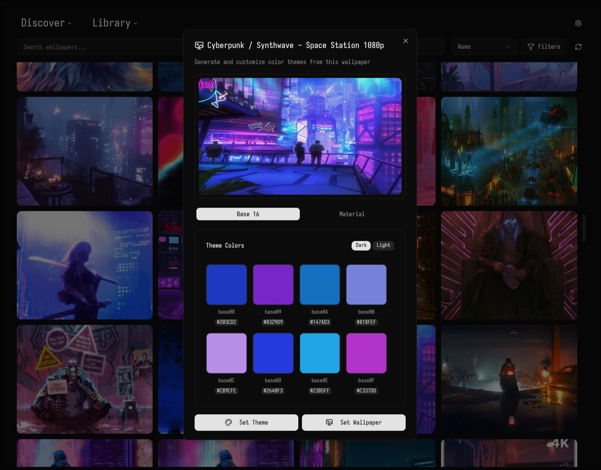

# Walltone

**Walltone** is a modern wallpaper and theme manager for Linux, supporting images, videos, and dynamic Wallpaper Engine content.
It automatically generates beautiful color themes from your wallpapers, and lets you browse, download, and apply wallpapers from popular online sources.



---

## 🚀 Features

- **Multi-Format Wallpapers:**
  - Static images (JPG, PNG, WebP, etc.) via swaybg
  - Video wallpapers (MP4, MKV, WebM) via mpvpaper
  - Animated wallpapers from Wallpaper Engine (Steam Workshop)

- **Online Sources:**
  - Browse and download from [Pexels](https://pexels.com), [Unsplash](https://unsplash.com), [Wallhaven](https://wallhaven.cc), and Wallpaper Engine

- **Theme Generation:**
  - Auto-generates Base16 and Material You color schemes (light & dark) from any wallpaper
  - Fine-tune colors with a built-in color picker
  - Export themes for use in other apps

- **Template Engine:**
  - Use templates with placeholders like `${theme.base16.dark.base00}`
  - Supports full JS evaluation (e.g. `${chroma.color(theme.material.dark.primary).darken(0.3)}`)

- **Multi-Monitor Support:**
  - Configure wallpapers per display
  - Visual monitor layout and scaling options

- **Dynamic Controls:**
  - Video: mute, scaling, etc.
  - Wallpaper Engine: volume, FPS, audio, parallax, fullscreen pause, texture clamping

- **Advanced Organization:**
  - Tag-based filtering, search, and sorting
  - Boolean filters for complex queries

- **Screenshot Utility:**
  - Automatically takes a screenshot of video or animated wallpapers
  - Use static images for login managers, GRUB, etc.

---

## 🛠️ Installation

### Prerequisites

**System Requirements:**

- Linux distribution
- Node.js 18+ and npm/yarn
- [`swaybg`](https://github.com/swaywm/swaybg) - for static images
- [`mpvpaper`](https://github.com/GhostNaN/mpvpaper) - for video wallpapers
- [`linux-wallpaperengine`](https://github.com/catsout/wallpaper-engine-kde-plugin) - for Wallpaper Engine
- [`cage`](https://github.com/cage-kiosk/cage) -  runs wallpapers in an isolated, invisible Wayland session specifically so we can screenshot them without affecting the user’s desktop
- [`grim`](https://github.com/emersion/grim) - takes a screenshot of the wallpaper running inside cage

### Arch Linux (AUR)

Walltone is available as [`walltone-git`](https://aur.archlinux.org/packages/walltone-git) on the AUR.

```sh
# With an AUR helper (yay, paru, etc.)
yay -S walltone-git

# Or manually
git clone https://aur.archlinux.org/walltone-git.git
cd walltone-git
makepkg -si
```

---

### Nix (Flake)

Walltone provides a Nix flake for easy installation.

```sh
# Install system-wide (NixOS)
nix profile install github:Kasper24/walltone

# Or run directly
nix run github:Kasper24/walltone
```

#### Using the flake in your own configuration

Add to your `flake.nix` inputs:

```nix
inputs.walltone.url = "github:Kasper24/walltone";
```

Then use in your configuration:

```nix
environment.systemPackages = [ inputs.walltone.packages.${pkgs.system}.default ];
```

---

## 🐧 Other Distributions

Walltone can be built from source on any Linux system:

```sh
git clone https://github.com/Kasper24/walltone.git
cd walltone
npm install
npm run make
```

---

## 📖 Usage Guide

### 1. Initial Setup

To get the most out of Walltone, a one-time setup is recommended:

- **Add Local Folders**: Go to `Settings` → `Library` to add directories where your wallpapers are stored.
- **Configure Online Sources**: In `Settings`, add your API keys for Pexels, Unsplash, and Wallhaven to unlock their vast libraries.
- **Enable Wallpaper Engine** (Optional):
    1. First, install Wallpaper Engine on Steam.
    2. Get a [Steam Web API Key](https://steamcommunity.com/dev/apikey).
    3. In `Settings` → `Wallpaper Engine`, enter your API key.
    4. Set the paths for your Steam workshop folder (`~/.steam/steam/steamapps/workshop/content/431960`) and Wallpaper Engine assets folder (`~/.steam/steam/steamapps/common/wallpaper_engine/assets`).

### 2. Core Workflow: Find, Apply, and Theme

Your daily workflow is a simple three-step process:

1. **Find Your Wallpaper**:
    - **Browse** your local library or online sources using the main tabs.
    - **Search and filter** to quickly find what you're looking for.

2. **Preview and Configure**:
    - **Click** any wallpaper to open the detailed preview dialog.
    - **Assign** the wallpaper to specific monitors and adjust scaling options.
    - **Tweak** dynamic controls like volume or FPS for video and Wallpaper Engine content.

3. **Apply and Generate a Theme**:
    - **Apply** the wallpaper to your selected displays.
    - **Switch** to the `Base16` or `Material You` tabs in the preview dialog to see the auto-generated color scheme.
    - **Customize** colors with the built-in color picker and export the theme for your other applications.

---

## 🏗️ Development

### Project Structure

```text
├── src/
│   ├── electron/                # Main process & backend logic
│   │   ├── main/                # Electron entry point & main logic
│   │   │   └── trpc/            # tRPC API routes and procedures
│   │   └── preload/             # Scripts that run before the web page is loaded
│   └── renderer/                # React frontend (UI)
│       ├── assets/              # Static assets (icons, fonts)
│       ├── components/          # Reusable UI components
│       ├── hooks/               # Custom React hooks
│       ├── lib/                 # Frontend utility functions
│       ├── styles/              # Global styles and Tailwind CSS config
│       └── tabs/                # Components for each main application tab
├── forge.config.ts              # Electron Forge build & packaging config
├── vite.*.config.ts             # Vite configurations for different parts of the app
├── package.json                 # Project dependencies and scripts
└── README.md                    # This file
```

### Development Commands

```bash
# Start development server
npm run start

# Build for production
npm run package

# Formatting checks
npm run format:check

# Linting checks
npm run lint:check

# Typing checks
npm run link:types
```

### 🛠️ Built With

- **[Electron](https://electronjs.org)** - Desktop application framework
- **[React](https://reactjs.org)** - User interface library
- **[TailwindCSS](https://tailwindcss.com)** - Utility-first CSS framework
- **[Shadcn/ui](https://ui.shadcn.com)** - Beautiful component library
- **[TypeScript](https://typescriptlang.org)** - Type safety
- **[tRPC](https://trpc.io)** - End-to-end typesafe APIs

---

## 🤝 Contributing

Contributions and feedback are welcome!
Open an issue or pull request, or join the discussion.

---

## 📬 Support

- 🐛 **Bug Reports**: [GitHub Issues](https://github.com/your-username/walltone/issues)
- 💬 **Discussions**: [GitHub Discussions](https://github.com/your-username/walltone/discussions)

---

## 📝 License

This project is licensed under the GPL License - see the [LICENSE](LICENSE) file for details.
